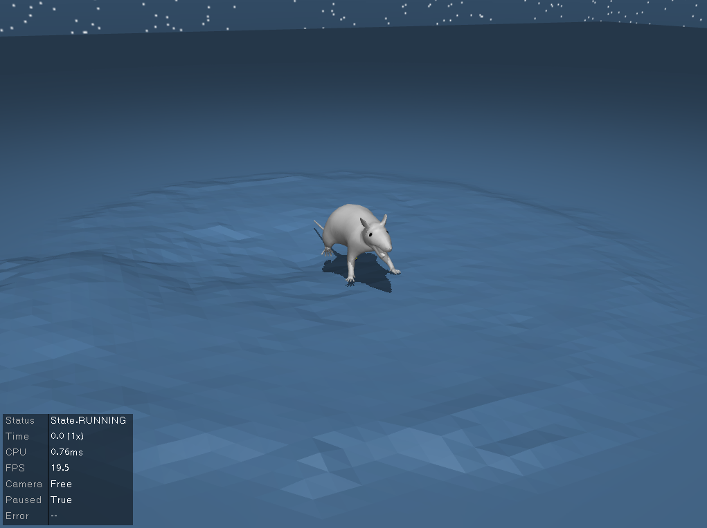

# stac
Implementation of simultaneous tracking and calibration (STAC) for calibrating mujoco rat models with Motion Capture data using the [dm_control suite](https://github.com/deepmind/dm_control).

[Original paper](https://ieeexplore.ieee.org/abstract/document/7030016)

## Requirements and Installation
As `stac` relies on `mujoco` and `dm_control`, we recommend building within a `virtualenv`.

`stac` has been tested with python 3.6 and Ubuntu 18.04.

* Install prerequisites using the included setup scripts.
```
python setup.py install
```
* Follow the instructions [here](https://www.roboti.us/license.html) to get a `mujoco` license. Install `mujoco` [here](https://www.roboti.us/index.html) or use the following template.
```
# Install mujoco
mkdir ~/.mujoco
cd ~/Downloads
echo Y | wget https://www.roboti.us/download/mujoco200_linux.zip
unzip mujoco200_linux.zip -d ~/.mujoco

# Download mjkey.txt that is sent to you .
cp /path/to/mjkey.txt ~/.mujoco/mujoco200_linux/
cp /path/to/mjkey.txt ~/.mujoco/mujoco200_linux/bin
```

* Follow the instructions [here](https://github.com/deepmind/dm_control) to install `dm_control`. If environment is correctly configured, this is as simple as:
```
pip install git+git://github.com/deepmind/dm_control.git
```

## Testing Installation

Test the installation by using one of the included visualization functions.

```
python view_model.py
```
If installation was successful, an interface like the one below should appear.



## Authors
* [Diego Aldarondo](https://github.com/diegoaldarondo)
* [Josh Merel](https://github.com/jsmerel)
* [Jesse Marshall](https://github.com/jessedmarshall)
* [Bence Olveczky](https://olveczkylab.oeb.harvard.edu/)
